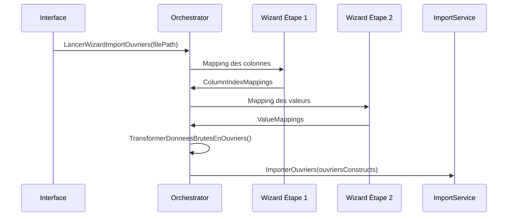
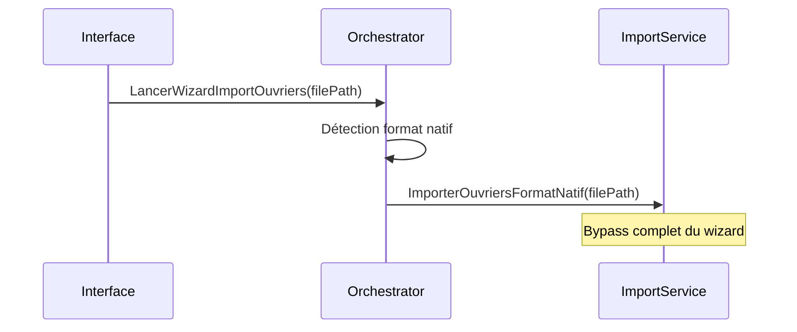

# Architecture Import/Export PlanAthena v0.5.0

## Vue d'ensemble

La version 0.5.0 introduit une refactorisation majeure de l'architecture d'import/export avec une séparation claire des responsabilités et l'ajout complet de la gestion des ouvriers.

## Changements Majeurs par Rapport à v0.4.8

### **ImportService** - Évolution vers le Chargement Pur
- **Supprimé** : Logique d'export (déplacée vers ExportService)
- **Supprimé** : Logique de mapping complexe (déplacée vers ImportWizardOrchestrator)
- **Ajouté** : Import d'ouvriers avec 2 voies (standard + format natif)
- **Ajouté** : Détection automatique du délimiteur CSV
- **Conservé** : Import de tâches (logique inchangée)

### **ImportWizardOrchestrator** - Nouvel Orchestrateur de Mapping
- **Nouveau service** : Gère entièrement le wizard d'import des ouvriers
- **Responsabilités** :
  - Validation des pré-requis (existence des métiers)
  - Orchestration du workflow UI (étapes du wizard)
  - Logique ETL complexe (Extract-Transform-Load)
  - Transformation des données brutes en objets métier
- **Architecture** : Utilise un état partagé (ImportOuvrierState) entre les étapes

### **ExportService** - Nouveau Service Dédié
- **Service spécialisé** : Responsabilité unique d'export vers CSV
- **Fonctionnalités** :
  - Export de tâches avec structure plate
  - Export d'ouvriers avec dénormalisation (une ligne par compétence)
  - Gestion de l'encodage UTF-8
  - Utilisation de ChoETL et DTOs spécialisés

## Architecture Détaillée

### Flux d'Import des Ouvriers

#### **Voie Standard (Wizard Complet)**


#### **Voie Rapide (Format Natif)**


### Structures de Données Clés

#### **ImportOuvrierState** - État Partagé du Wizard
```csharp
public class ImportOuvrierState
{
    public string FilePath { get; set; }
    public bool RemplacerExistants { get; set; }
    public bool HasHeaderRecord { get; set; }
    
    // Mapping colonnes : nom logique → index physique
    public Dictionary<string, int> ColumnIndexMappings { get; set; }
    
    // Mapping valeurs : valeur CSV → objet métier
    public Dictionary<string, MetierMappingItem> ValueMappings { get; set; }
}
```

#### **DTOs d'Export**
```csharp
// Pour les tâches : structure plate
public class TacheExportDto
{
    public string IdImporte { get; set; }
    public string TacheNom { get; set; }
    public string MetierId { get; set; }
    public int HeuresHommeEstimees { get; set; }
    public string BlocNom { get; set; }  // Résolution de relation
    public string Dependencies { get; set; }
    public string Type { get; set; }
}

// Pour les ouvriers : dénormalisation
public class OuvrierCsvRecord
{
    public string OuvrierId { get; set; }
    public string Nom { get; set; }
    public string Prenom { get; set; }
    public decimal CoutJournalier { get; set; }
    public string MetierId { get; set; }  // Une ligne par compétence
}
```

## Patterns Architecturaux Utilisés

### **Séparation des Responsabilités (SRP)**
- **ImportService** : Chargement pur des données
- **ImportWizardOrchestrator** : Logique de mapping et transformation
- **ExportService** : Sérialisation vers fichiers

### **Extract-Transform-Load (ETL)**
1. **Extract** : Lecture du fichier CSV brut
2. **Transform** : Application des mappings et construction des objets
3. **Load** : Chargement dans le système via les services métier

### **State Pattern**
- **ImportOuvrierState** : Encapsule l'état complet du processus d'import
- Permet le passage d'informations entre les étapes du wizard

### **Data Transfer Object (DTO)**
- **TacheExportDto** et **OuvrierCsvRecord** : Structures optimisées pour la sérialisation
- Découplage entre objets métier et format fichier

## Avantages de la Nouvelle Architecture

### **Maintenabilité**
- Responsabilités clairement séparées
- Code plus lisible et testable
- Réduction de la complexité de chaque service

### **Extensibilité**
- Facile d'ajouter de nouveaux formats d'import/export
- Architecture wizard réutilisable pour d'autres entités
- DTOs modulaires et configurables

### **Robustesse**
- Validation à plusieurs niveaux
- Gestion d'erreur centralisée
- Support de différents délimiteurs CSV

### **Performance**
- Voie rapide pour les formats standards
- Chargement optimisé avec ChoETL
- Transformation en mémoire pour les gros volumes

## Compatibilité et Migration

### **Rétrocompatibilité**
- L'import de tâches reste identique
- Les fichiers exportés sont compatibles avec l'import
- Pas de breaking changes pour l'utilisateur final

### **Format Natif PlanAthena**
```csv
OuvrierId;Nom;Prenom;CoutJournalier;MetierId
Ouv001;Durand;Paul;300;M001
Ouv001;Durand;Paul;300;M002
Ouv002;Martin;Marie;320;M003
```

### **Cycle Complet**
- **Export** → Fichier CSV standard
- **Import Format Natif** → Chargement direct (voie rapide)
- **Import Wizard** → Mapping personnalisé pour fichiers externes

## Tests et Validation

### **Couverture de Tests**
- **ImportServiceTests** : Focus sur le chargement pur
- **ImportWizardOrchestratorTests** : Logique de transformation
- **ExportServiceTests** : Sérialisation et DTOs

### **Scénarios de Test**
- Import avec mapping complexe
- Import format natif
- Export avec dénormalisation
- Gestion des erreurs et validations
- Détection automatique des délimiteurs

## Recommandations d'Usage

### **Pour les Développeurs**
1. Utiliser **ImportService** uniquement pour le chargement final
2. Étendre **ImportWizardOrchestrator** pour de nouveaux wizards
3. Créer des DTOs spécialisés pour nouveaux formats d'export

### **Pour les Utilisateurs**
1. **Format connu** → Utiliser la voie rapide (détection automatique)
2. **Format externe** → Passer par le wizard de mapping
3. **Export/Re-import** → Utiliser le format natif pour la cohérence

Cette architecture v0.5.0 établit une base solide et extensible pour la gestion des imports/exports dans PlanAthena, avec une séparation claire des responsabilités et une expérience utilisateur améliorée.